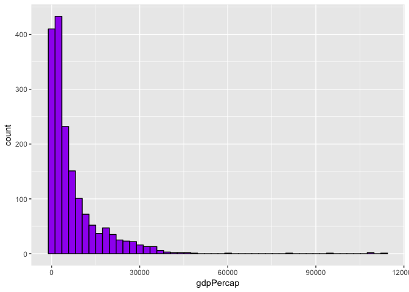
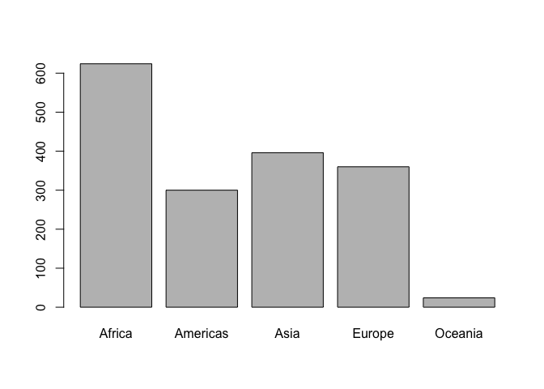
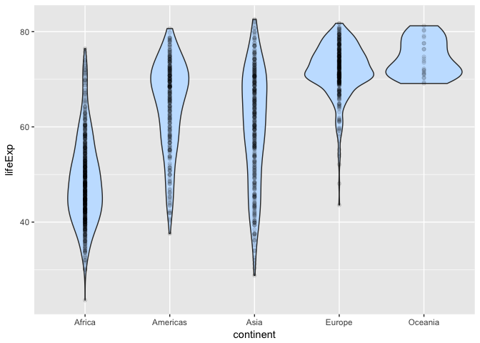
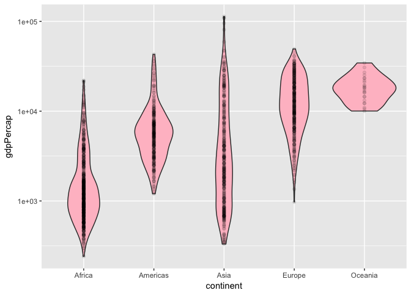
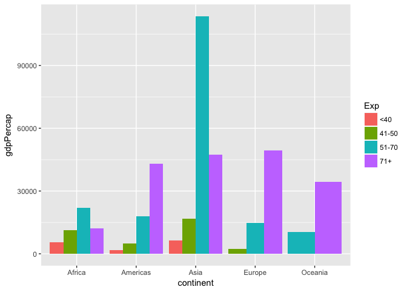

Homework2: Exploring Gapminder dataset using dplyr
================
Jummy David
September 25, 2018

-   [Smell testing the data:](#smell-testing-the-data)
-   [Exploring individual variables:](#exploring-individual-variables)
    -   [Exploring quantitative variable `gdpPercap`:](#exploring-quantitative-variable-gdppercap)
    -   [Exploring categorical variable `continent`:](#exploring-categorical-variable-continent)
    -   [One quantitative and one categorical variable](#one-quantitative-and-one-categorical-variable)
    -   [Two quantitative variables:](#two-quantitative-variables)
    -   [Two quantitative and one categorical variables:](#two-quantitative-and-one-categorical-variables)
    -   [Three quantitative and one categorical variables:](#three-quantitative-and-one-categorical-variables)
    -   ["Complete" plot](#complete-plot)
-   [I want to do more](#i-want-to-do-more)

In this homework, we will explore different variables. To start with, load the `tidyverse` and `gapminder` R packages.

``` r
library(gapminder)
```

    ## Warning: package 'gapminder' was built under R version 3.3.2

``` r
library(tidyverse)
```

    ## ── Attaching packages ──────────────────────────────────────────────────────────────────────── tidyverse 1.2.1 ──

    ## ✔ ggplot2 2.2.1     ✔ purrr   0.2.4
    ## ✔ tibble  1.4.2     ✔ dplyr   0.7.4
    ## ✔ tidyr   0.8.1     ✔ stringr 1.3.0
    ## ✔ readr   1.1.1     ✔ forcats 0.3.0

    ## Warning: package 'ggplot2' was built under R version 3.3.2

    ## Warning: package 'readr' was built under R version 3.3.2

    ## Warning: package 'purrr' was built under R version 3.3.2

    ## Warning: package 'dplyr' was built under R version 3.3.2

    ## ── Conflicts ─────────────────────────────────────────────────────────────────────────── tidyverse_conflicts() ──
    ## ✖ dplyr::filter() masks stats::filter()
    ## ✖ dplyr::lag()    masks stats::lag()

``` r
?gapminder # to know more about the dataset
```

Smell testing the data:
-----------------------

Looking at the class of a dataset, is it a data.frame? `class` can be used to check if the dataset is a data frame.

``` r
head(gapminder)
```

    ## # A tibble: 6 x 6
    ##   country     continent  year lifeExp      pop gdpPercap
    ##   <fct>       <fct>     <int>   <dbl>    <int>     <dbl>
    ## 1 Afghanistan Asia       1952    28.8  8425333      779.
    ## 2 Afghanistan Asia       1957    30.3  9240934      821.
    ## 3 Afghanistan Asia       1962    32.0 10267083      853.
    ## 4 Afghanistan Asia       1967    34.0 11537966      836.
    ## 5 Afghanistan Asia       1972    36.1 13079460      740.
    ## 6 Afghanistan Asia       1977    38.4 14880372      786.

``` r
class(gapminder)
```

    ## [1] "tbl_df"     "tbl"        "data.frame"

`Structure` which can be written as `str` is used as a single command to smell check the data. It also shows that it is a data frame, with 1704 observations and 6 variables. It gives other information about the data.

``` r
str(gapminder)
```

    ## Classes 'tbl_df', 'tbl' and 'data.frame':    1704 obs. of  6 variables:
    ##  $ country  : Factor w/ 142 levels "Afghanistan",..: 1 1 1 1 1 1 1 1 1 1 ...
    ##  $ continent: Factor w/ 5 levels "Africa","Americas",..: 3 3 3 3 3 3 3 3 3 3 ...
    ##  $ year     : int  1952 1957 1962 1967 1972 1977 1982 1987 1992 1997 ...
    ##  $ lifeExp  : num  28.8 30.3 32 34 36.1 ...
    ##  $ pop      : int  8425333 9240934 10267083 11537966 13079460 14880372 12881816 13867957 16317921 22227415 ...
    ##  $ gdpPercap: num  779 821 853 836 740 ...

Checking the number of rows and columns with `nrow` and `ncol` respectively and as well with `dim`.

``` r
nrow(gapminder) #checks the number of rows/observations (1704)
```

    ## [1] 1704

``` r
ncol(gapminder) #checks the number of columns/variables (6)
```

    ## [1] 6

``` r
dim(gapminder) #the number of rows/observations (1704) and columns/variables (6)
```

    ## [1] 1704    6

Extent/size of a dataset

``` r
length(gapminder) #Shows that it is of 6 variables
```

    ## [1] 6

``` r
dim(gapminder) #the number of rows/observations (1704) and columns/variables (6)
```

    ## [1] 1704    6

In summary, we have;

Data type in each variable. It gives each variable name and data type.

| Variables | Data type                        |
|-----------|----------------------------------|
| country   | `categorical/qualitative/factor` |
| continent | `categorical/qualitative/factor` |
| year      | `quantitative/integer`           |
| lifeExp   | `quantitative/numeric`           |
| pop       | `quantitative/integer`           |
| gdbPercap | `quantitative/numeric`           |

`sapply` also gives each variable name and data type

``` r
sapply(gapminder, class) 
```

    ##   country continent      year   lifeExp       pop gdpPercap 
    ##  "factor"  "factor" "integer" "numeric" "integer" "numeric"

Exploring individual variables:
-------------------------------

``` r
head(gapminder) # this shows the first 6 rows and all columns of gapminder dataset.
```

    ## # A tibble: 6 x 6
    ##   country     continent  year lifeExp      pop gdpPercap
    ##   <fct>       <fct>     <int>   <dbl>    <int>     <dbl>
    ## 1 Afghanistan Asia       1952    28.8  8425333      779.
    ## 2 Afghanistan Asia       1957    30.3  9240934      821.
    ## 3 Afghanistan Asia       1962    32.0 10267083      853.
    ## 4 Afghanistan Asia       1967    34.0 11537966      836.
    ## 5 Afghanistan Asia       1972    36.1 13079460      740.
    ## 6 Afghanistan Asia       1977    38.4 14880372      786.

``` r
attach(gapminder) #this makes it possible to use any variable of the gapminder dataset without using the `$` sign. i.e you can use gdpPercap instead of gapminder$gdpPercap.
```

### Exploring quantitative variable `gdpPercap`:

The `summary` command generates the minimum, 1st quartile, median, mean, 3rd quartile and maximum values of variable `gdpPercap`

``` r
summary(gdpPercap) 
```

    ##     Min.  1st Qu.   Median     Mean  3rd Qu.     Max. 
    ##    241.2   1202.0   3532.0   7215.0   9325.0 113500.0

Using `ggplot` for a histogram to summarize the quantitative variable `gdpPercap` and by changing the number of bins to 50. This shows the spread/frequency of `gdpPercap`

``` r
ggplot(gapminder, aes(x = gdpPercap)) + 
  geom_histogram(colour = "black", bins = 50, fill = "purple")
```



We can also make a kernel density plot of the variable `gdpPercap`. It gives a similar information as the histogram. It shows that gdpPercap around 10000 has the highest density.

``` r
ggplot(gapminder, aes(gdpPercap)) + 
  geom_density(bw=0.1, fill = "forestgreen")
```


This is the combination of histogram and kernel density. It is possible to have the histogram and the kernel density on a single plot as below.

``` r
ggplot(gapminder, aes(gdpPercap)) + 
  geom_histogram(aes(y=..density..), colour = "black", bins = 50, fill = "purple") +
  geom_density()
```


### Exploring categorical variable `continent`:

We want to know the number of countries in each continent by using the command `table`. The command `pie` shows the piechart which confirms that African continent has the highest number of countries and Oceania has the lowest.

``` r
Table <- table(continent)
Table  
```

    ## continent
    ##   Africa Americas     Asia   Europe  Oceania 
    ##      624      300      396      360       24

``` r
pie(Table)
```


The command `barplot` shows the distribution of each continent.

``` r
barplot(Table)
```

 Making the piechart of the summary of variable `continent` gives a similar result as the `table` command.

``` r
pie(summary(continent))
```


We can also use `ggplot` and `geom` to generate a similar barplot. It gives the frequency of each continent and also show that Africa has more countries while Oceania has less countries.

``` r
ggplot(data = gapminder) +
  geom_bar(mapping = aes(x = continent, fill = continent))
```


Here I show how we can make a pie chart from a single categorical variable `continent` and the number countries in each continent using the command `coord_polar`. It shows how continent are partitioned. Here we use `theta=y`.

``` r
b <- ggplot(data = gapminder) +
  geom_bar(mapping = aes(x = continent, fill = continent))
b + coord_polar(theta = "y")
```


This is the same as above, just that here, we use `theta=x`.

``` r
b <- ggplot(data = gapminder) +
  geom_bar(mapping = aes(x = continent, fill = continent))
b + coord_polar(theta = "x")
```

 \#\# Exploring various plot types:

### One quantitative and one categorical variable

#### Boxplots

Here, I show the boxplot of gdpPercap among all continent using pink colour. I also use the `ggtitle` to specify the title of the plot. This shows that Oceania has the highest gdpPercap, while Africa has the lowest.

``` r
ggplot(aes(x = continent, y = gdpPercap), data =gapminder) +
geom_boxplot(fill = "pink") +
ggtitle("gdpPercap among all continent")+theme(plot.title = element_text(hjust = 0.5))
```


This gives a similar result, but here we rescaled by using the command `scale_y_log10` to see a clearer difference between the boxplots.

``` r
ggplot(aes(x = continent, y = gdpPercap), data =gapminder) +
  scale_y_log10() +
geom_boxplot(fill = "pink") +
ggtitle("gdpPercap among all continent")+theme(plot.title = element_text(hjust = 0.5))
```


Here, I show the boxplot of life expectancy in all continent using slategray1 colour. The command `scale_y_log10` is used for rescaling. This shows that Oceania has the highest lifeExp, while Africa has the lowest.

``` r
ggplot(gapminder, aes(continent, lifeExp)) +
  scale_y_log10() +
  geom_boxplot(fill = "slategray1")
```


#### Violin plots

This is a violin plot using the command `geom_violin`. It shows the distribution of life expectancy in each continent. We also see here that Oceania have higher life expectancy

``` r
ggplot(gapminder, aes(continent, lifeExp)) +
  geom_violin(fill = "slategray1")
```


Similarly, this is a violin plot using the command `geom_violin` as well as rescaling to shows the distribution of gdpPercap in each continent. We also see here that Oceania have higher gdpPercap and Africa have the lowest.

``` r
ggplot(gapminder, aes(continent, gdpPercap)) +
  scale_y_log10() +
  geom_violin(fill = "pink")
```


This is a violin plot with geometric point using the command `geom_violin` together with `geom_point`. It also shows the distribution of life expectancy in each continent.

``` r
ggplot(gapminder, aes(continent, lifeExp)) +
  geom_violin(fill = "slategray1") +
  geom_point(alpha=0.1)
```



It shows the distribution of gdpPercap in each continent. We also rescale here.

``` r
ggplot(gapminder, aes(continent, gdpPercap)) +
  scale_y_log10() +
  geom_violin(fill = "pink") +
  geom_point(alpha=0.1)
```



#### Jitter plots

This is a violin plot with jitter plot using the command `geom_jitter`. It also shows the distribution of gdpPercap in each continent. I rescaled here as well.

``` r
ggplot(gapminder, aes(continent, gdpPercap)) +
  scale_y_log10() +
  geom_violin() +
  geom_jitter(alpha=0.3) 
```


This is also a violin plot with geometric point using the command `geom_violin` together with `geom_point`. It shows the distribution of life expectancy in each continent.

``` r
ggplot(gapminder, aes(continent, lifeExp)) +
  geom_violin() +
  geom_jitter(alpha=0.3)
```

 This is the histogram of each continent versus their gdpPercap. The command `facet_wrap` is used to make separate histograms for each continent. The command `free_x` is used to make each continent have their own x-axisand not a shared x=axis. We can see here that Africa has the highest count of gdpPercap.

``` r
ggplot(gapminder, aes(x = gdpPercap, fill = "colour")) + 
  geom_histogram(colour = 'black') + 
  facet_wrap('continent', scales = "free_x")
```

    ## `stat_bin()` using `bins = 30`. Pick better value with `binwidth`.


### Two quantitative variables:

Scatterplot of `gdpPercap` vs. `lifeExp`. This is the scatter plot of gdpPercap and life expectancy using the command `geom_point`.

``` r
ggplot(gapminder, aes(x=lifeExp, y=gdpPercap)) + geom_point()
```


This scatter plot of gdpPercap and life expectancy using the command `geom_line`.

``` r
ggplot(gapminder, aes(lifeExp, gdpPercap)) +
  geom_line()
```


Here, we show the smooth curve of lifeExp versus gdpPercap using the command `geom_smooth`.

``` r
ggplot(data=gapminder) +
  geom_smooth(mapping = aes(lifeExp, gdpPercap))
```

    ## `geom_smooth()` using method = 'gam'


### Two quantitative and one categorical variables:

Here we write a code that: 1. select variables country, lifeExp and gdpPercap from the data 2. filters the data to Nigeria only 3. pipes the filtered data into `ggplot` 4. makes the time plot of `lifeExp` and `gdpPercap` 5. displays the points 6. add the line to join the points

``` r
gapminder %>%
  select(country, lifeExp, gdpPercap) %>% 
  filter(country == "Nigeria") %>%
  ggplot(aes(lifeExp, gdpPercap)) +
  geom_line() +
  geom_point()
```

    ## Warning: package 'bindrcpp' was built under R version 3.3.2


This is the scatter plot of `gdpPercap` versus `lifeExp` stratified by different continent. The command `facet_wrap` slpit the scatter plot into different continents. We can see from the plot below that the life expectancy of African continent settles below the gdpPercap of 30000, while the life expectancy of Oceania continent between 71 and 80 settles have a gdpPercap between 10000 to 40000.

``` r
ggplot(data=gapminder) +
  geom_point(mapping = aes(lifeExp, gdpPercap, color = continent)) + 
  facet_wrap(~ continent, scales = "free_x")
```

 Using the command `facet_grid` and including `dot` with the command `facet_grid(.~ continent)` put all of the plots side by side one another for better comparison. This makes it obvious to see that African continent with life expectancy between 0 and less than 80 have their gdpPercap lower than 30000.

``` r
ggplot(data=gapminder) +
  geom_point(mapping = aes(lifeExp, gdpPercap, color = continent)) + 
  facet_grid(.~ continent)
```


The command `geom_smooth` produces a smooth curve with confidence interval and `colour=continent` splitted and coloured the curve by different continent.

``` r
ggplot(data=gapminder) +
  geom_smooth(mapping = aes(lifeExp, gdpPercap, color = continent))
```

    ## `geom_smooth()` using method = 'loess'


This is the scatter plot of `gdpPercap` versus `lifeExp` coloured by different continent, The command `geom_point` gives different points of `gdpPercap` versus `lifeExp` of different continent. The command `geom_smooth` gives two lines that filters down to only African continent (the longer line) and Oceania continent (the shorter line).

``` r
ggplot(data=gapminder, mapping = aes(lifeExp, gdpPercap)) +
  geom_point(mapping = aes(color = continent)) +
  geom_smooth(data = filter(gapminder, continent == "Africa")) +
  geom_smooth(data = filter(gapminder, continent == "Oceania"))
```

    ## `geom_smooth()` using method = 'loess'
    ## `geom_smooth()` using method = 'loess'


#### Relation between gdpPercap and lifeExp, adjusting for continent using boxplot.

We can categorize variable `lifeExp` so as to use it as a categorical variable. The plot shows the boxplot of gdpPercap versus categorize life expectancy and among different continent. The boxplots below show alot of information. Majority of Africans who have their life expectancy between 51 − 70 have the highest gdpPercap. Asians have similar life expectancy across all group but with slightly different gdpPercap. Many Oceanians have their life expectancy between 41 − 50 but with slightly different gdpPercap.

``` r
summary(lifeExp) #this give the minimum, 1st and 3rd quartile, median, mean and maximun.
```

    ##    Min. 1st Qu.  Median    Mean 3rd Qu.    Max. 
    ##   23.60   48.20   60.71   59.47   70.85   82.60

``` r
Exp <- cut(lifeExp, breaks = c(0,40,50,70,85), label=c("<40","41-50", "51-70","71+")) #this line converts the quantitative variable lifeExp to a categorical variable of 4 levels.

ggplot(data = gapminder, aes(x = Exp, y = gdpPercap)) +
  scale_y_log10() +
  geom_boxplot(fill = "slategray1") +
  facet_wrap(~continent, scales = "free_x") 
```


#### Density plots of gdpPercap by continent from 1992 upward.

Here we filltered years above 1987, pipes into ggplot and make a density plot of life expectancy of different continent in 4 different years. Across all years and relative to other continent, Oceania have the highest density of lifeExp.

``` r
gapminder %>%
  filter(year > 1987) %>%
  ggplot(aes(x = lifeExp, fill = continent)) + facet_wrap(~year, scales = "free_x") +
  geom_density(alpha = 0.5)
```


#### Barplot of two quantitative and one categorical variable.

This is a multiple barplot comparing the gdpPercap of different continent versus their categorized life expectancy. I used `fill=continent` to have the barplot coloured by different continent and used `dodge` to have a separate barplot of different continent in each group and so as not to have them stacked on a barplot.

Here, for each group of life expectancy, we have all the continent. For example, among group with life expectancy 51 − 70, the gdpPercap is highest in Asia . Similarly, among group with life expectancy 71+, the gdpPercap is lowest in Africa.

``` r
ggplot(gapminder, aes(fill=continent, y=gdpPercap, x=Exp)) + 
    geom_bar(position="dodge", stat="identity") +
  labs(x="Categorized life expectancy", y="gdpPercap")
```

 This is a similar multiple barplot comparing the gdpPercap of different category of life expectancy among all continent. I used `fill=Exp` to have the barplot coloured by different category of lifeExp and similarly used `dodge` to have a separate barplot of different category of lifeExp in each continent and so as not to have them stacked on a barplot.

Here, for each continent, we have all group of life expectancy. For example in Africa, the group with life expectancy between 51 − 70 have the highest gdpPercap. In Americas, the group with life expectancy around 71+ have the highest gdpPercap. Similarly in Oceania, only two life expectancy group exist. i.e life expectancy of Oceanians falls between 51 − 71+ and with 71+ having the highest gdpPercap.

``` r
ggplot(gapminder, aes(fill=Exp, y=gdpPercap, x=continent)) + 
    geom_bar(position="dodge", stat="identity") +
  labs(x="continent", y="gdpPercap")
```

 This is a similar bar plot, just that `facet_wrap` was used to separate the barplot into different continent.

``` r
ggplot(gapminder, aes(y=gdpPercap, x=Exp, fill=Exp)) + 
    geom_bar( stat="identity") +    
    facet_wrap(~continent, scales = "free_x")
```


### Three quantitative and one categorical variables:

Here we write a code that: 1. select variables continent, year, lifeExp and gdpPercap from the data 2. filters the data to year 2007 only 3. pipes the filtered data into `ggplot` 4. makes the time plot of `lifeExp` and `gdpPercap` and colour by continent 5. displays the points 6. add the title

We can see that most African countries with gdpPercap of 10000 and lower have the their life expectancy between 30 to 60 in the year 2007. For all other continent, it is obvious that the most highest gdpPercap is around 10000 with life expectancy between 70 and 85 in the same year.

``` r
gapminder %>%
  select(continent, year, lifeExp, gdpPercap) %>% #select only continent, year, lifeExp, gdpPercap
  filter(year == "2007") %>% #filter down to only year 2007.
  ggplot(aes(lifeExp, gdpPercap, colour = continent )) +
  geom_point() +
  labs(title = "Scatterplot of gdpPercap in the year 2007 coloured by continent")
```


Here we write a code that: 1. select variables continent, year, lifeExp and gdpPercap from the data 2. filters the data to year 1952 only 3. pipes the filtered data into `ggplot` 4. makes the time plot of `lifeExp` and `gdpPercap` and colour by continent 5. displays the points 6. add the title

The interpretation of the graph is the same as above, just that this one is for the year 1952.

``` r
gapminder %>%
  select(continent, year, lifeExp, gdpPercap) %>% #select only continent, year, lifeExp, gdpPercap
  filter(year == "1952") %>% #filter down to only year 2007.
  ggplot(aes(lifeExp, gdpPercap, colour = continent )) +
  geom_point() +
  labs(title = "Scatterplot of gdpPercap in the year 2007 coloured by continent")
```


### "Complete" plot

Plotting much of the data.

-   lifeExp vs pop with gdpPercap bubbles
-   facet by year
-   colour by continent

``` r
ggplot(gapminder, aes(lifeExp,pop)) +
  scale_y_log10() +
  geom_point(aes(size=gdpPercap, colour=continent)) +
  scale_size_area() +
  facet_wrap(~ year)
```


I want to do more
-----------------

Using either the command `%in%` or `|` gives what they wanted (24 rows).

``` r
filter(gapminder, country ==c("Rwanda", "Afghanistan")) #produces 12 rows for variable country=="Rwanda" and country=="Afghanistan". This captures 6rows each and it is not what they want.
```

    ## # A tibble: 12 x 6
    ##    country     continent  year lifeExp      pop gdpPercap
    ##    <fct>       <fct>     <int>   <dbl>    <int>     <dbl>
    ##  1 Afghanistan Asia       1957    30.3  9240934      821.
    ##  2 Afghanistan Asia       1967    34.0 11537966      836.
    ##  3 Afghanistan Asia       1977    38.4 14880372      786.
    ##  4 Afghanistan Asia       1987    40.8 13867957      852.
    ##  5 Afghanistan Asia       1997    41.8 22227415      635.
    ##  6 Afghanistan Asia       2007    43.8 31889923      975.
    ##  7 Rwanda      Africa     1952    40    2534927      493.
    ##  8 Rwanda      Africa     1962    43    3051242      597.
    ##  9 Rwanda      Africa     1972    44.6  3992121      591.
    ## 10 Rwanda      Africa     1982    46.2  5507565      882.
    ## 11 Rwanda      Africa     1992    23.6  7290203      737.
    ## 12 Rwanda      Africa     2002    43.4  7852401      786.

``` r
gapminder %>%
  filter(country =="Rwanda") #produces 12 rows for variable country=="Rwanda"
```

    ## # A tibble: 12 x 6
    ##    country continent  year lifeExp     pop gdpPercap
    ##    <fct>   <fct>     <int>   <dbl>   <int>     <dbl>
    ##  1 Rwanda  Africa     1952    40   2534927      493.
    ##  2 Rwanda  Africa     1957    41.5 2822082      540.
    ##  3 Rwanda  Africa     1962    43   3051242      597.
    ##  4 Rwanda  Africa     1967    44.1 3451079      511.
    ##  5 Rwanda  Africa     1972    44.6 3992121      591.
    ##  6 Rwanda  Africa     1977    45   4657072      670.
    ##  7 Rwanda  Africa     1982    46.2 5507565      882.
    ##  8 Rwanda  Africa     1987    44.0 6349365      848.
    ##  9 Rwanda  Africa     1992    23.6 7290203      737.
    ## 10 Rwanda  Africa     1997    36.1 7212583      590.
    ## 11 Rwanda  Africa     2002    43.4 7852401      786.
    ## 12 Rwanda  Africa     2007    46.2 8860588      863.

``` r
gapminder %>%
  filter(country =="Afghanistan") #produces 12 rows for variable country=="Afghanistan"
```

    ## # A tibble: 12 x 6
    ##    country     continent  year lifeExp      pop gdpPercap
    ##    <fct>       <fct>     <int>   <dbl>    <int>     <dbl>
    ##  1 Afghanistan Asia       1952    28.8  8425333      779.
    ##  2 Afghanistan Asia       1957    30.3  9240934      821.
    ##  3 Afghanistan Asia       1962    32.0 10267083      853.
    ##  4 Afghanistan Asia       1967    34.0 11537966      836.
    ##  5 Afghanistan Asia       1972    36.1 13079460      740.
    ##  6 Afghanistan Asia       1977    38.4 14880372      786.
    ##  7 Afghanistan Asia       1982    39.9 12881816      978.
    ##  8 Afghanistan Asia       1987    40.8 13867957      852.
    ##  9 Afghanistan Asia       1992    41.7 16317921      649.
    ## 10 Afghanistan Asia       1997    41.8 22227415      635.
    ## 11 Afghanistan Asia       2002    42.1 25268405      727.
    ## 12 Afghanistan Asia       2007    43.8 31889923      975.

``` r
gapminder %>%
  filter(country %in% c("Rwanda", "Afghanistan")) #produces 24 rows for variable country=="Rwanda" and country=="Afghanistan". This is what they want.
```

    ## # A tibble: 24 x 6
    ##    country     continent  year lifeExp      pop gdpPercap
    ##    <fct>       <fct>     <int>   <dbl>    <int>     <dbl>
    ##  1 Afghanistan Asia       1952    28.8  8425333      779.
    ##  2 Afghanistan Asia       1957    30.3  9240934      821.
    ##  3 Afghanistan Asia       1962    32.0 10267083      853.
    ##  4 Afghanistan Asia       1967    34.0 11537966      836.
    ##  5 Afghanistan Asia       1972    36.1 13079460      740.
    ##  6 Afghanistan Asia       1977    38.4 14880372      786.
    ##  7 Afghanistan Asia       1982    39.9 12881816      978.
    ##  8 Afghanistan Asia       1987    40.8 13867957      852.
    ##  9 Afghanistan Asia       1992    41.7 16317921      649.
    ## 10 Afghanistan Asia       1997    41.8 22227415      635.
    ## # ... with 14 more rows

``` r
gapminder %>%
  filter(country=="Rwanda" | country=="Afghanistan") #produces 24 rows for variable country=="Rwanda" and country=="Afghanistan". This is also what they want.
```

    ## # A tibble: 24 x 6
    ##    country     continent  year lifeExp      pop gdpPercap
    ##    <fct>       <fct>     <int>   <dbl>    <int>     <dbl>
    ##  1 Afghanistan Asia       1952    28.8  8425333      779.
    ##  2 Afghanistan Asia       1957    30.3  9240934      821.
    ##  3 Afghanistan Asia       1962    32.0 10267083      853.
    ##  4 Afghanistan Asia       1967    34.0 11537966      836.
    ##  5 Afghanistan Asia       1972    36.1 13079460      740.
    ##  6 Afghanistan Asia       1977    38.4 14880372      786.
    ##  7 Afghanistan Asia       1982    39.9 12881816      978.
    ##  8 Afghanistan Asia       1987    40.8 13867957      852.
    ##  9 Afghanistan Asia       1992    41.7 16317921      649.
    ## 10 Afghanistan Asia       1997    41.8 22227415      635.
    ## # ... with 14 more rows

Here I want to use the `knitr::kable()` command to have a more fancy table. We will start by installing the necessary package and calling the libraries.

    install.packages("kableExtra")

``` r
library(knitr)
library(kableExtra)
```

Here I pipe and filter the country down to `Rwanda` and `Afghanistan`, use the `kable` command to have a fancy plot, use the command `kable_styling(full_width = F)` to shrink the size of the table.

Note: I decided not to display the kable code because it takes a longer time to run and makes the knitting slower. But here is the code:

    gapminder %>%
      filter(country=="Rwanda" | country=="Afghanistan") %>%
      kable() %>%
      kable_styling(full_width = F)
